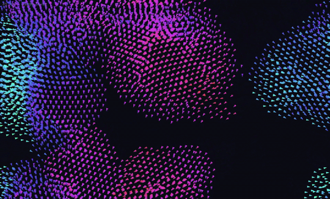

# Boids

A 2D flocking simulation built in Rust with [macroquad](https://macroquad.rs/).



## The rules

Each boid looks at the flockmates within its `neighbor_radius` and blends three
classic steering forces:

- **Separation** - steer away from boids that get too close (within `separation_radius`)
- **Alignment** - match the average heading of nearby boids
- **Cohesion** - steer toward the average position of nearby boids

Steering is computed for every boid before any of them move, so each one reacts
to where its neighbors *were* this frame rather than mid-update. Boids that
leave one edge of the screen wrap around to the opposite side.

## Run

```sh
cargo run --release
```

A window opens with the flock. Hold **Up** to spawn more boids and **Down** to
remove them, and watch the FPS readout react live.

## Performance

The sim handles huge flocks thanks to two optimizations:

- **Spatial grid** - boids only interact within `neighbor_radius`, so each frame
  the flock is bucketed into a grid of cells and each boid only checks the 3x3
  block of cells around it instead of every other boid. This turns the neighbor
  search from O(n²) to roughly O(n) - the change that actually unlocks big flocks.
- **Parallelism** - steering for all boids is computed across CPU cores with
  [rayon](https://crates.io/crates/rayon) (one `into_par_iter()`), since each
  boid's steering only reads the flock and can run independently.

## Project layout

| File           | Responsibility                                              |
| -------------- | ----------------------------------------------------------- |
| `src/main.rs`  | Window setup, keyboard controls, and the draw/update loop   |
| `src/flock.rs` | The flock, the three steering rules, and tunable `Settings` |
| `src/grid.rs`  | The spatial grid used for fast neighbor lookups             |
| `src/boid.rs`  | A single boid's position, velocity, and how it's drawn      |

## Tuning

The flock's behavior lives in `Settings` (`src/flock.rs`). The defaults:

| Setting             | Default | Effect                                       |
| ------------------- | ------- | -------------------------------------------- |
| `neighbor_radius`   | `60.0`  | How far a boid looks for flockmates          |
| `separation_radius` | `24.0`  | Distance at which boids start pushing apart  |
| `separation`        | `1.6`   | Weight of the "don't crowd me" force         |
| `alignment`         | `1.0`   | Weight of matching neighbors' heading        |
| `cohesion`          | `0.9`   | Weight of pulling toward the group center    |
| `max_speed`         | `220.0` | Speed cap (pixels/second)                    |
| `max_force`         | `240.0` | Turn-rate cap how sharply a boid can steer |

Crank `cohesion` for tighter swarms, raise `separation` for looser drifts, or
shrink `neighbor_radius` for jittery, fragmented chaos.
